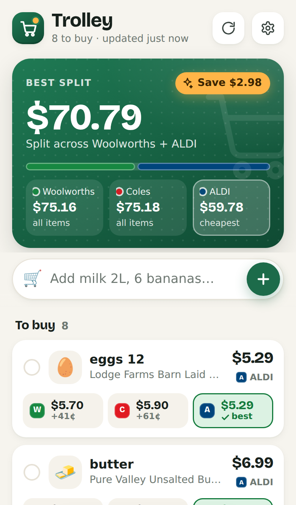
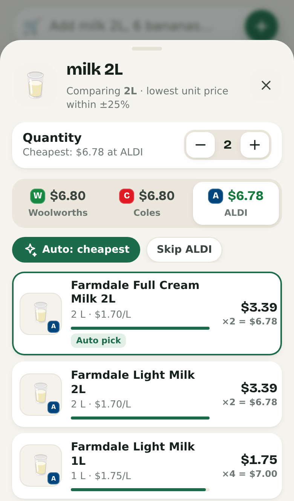
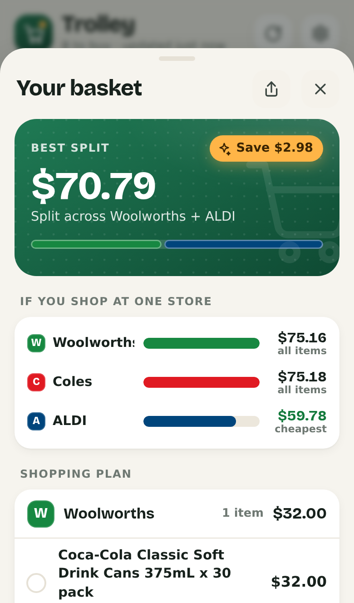
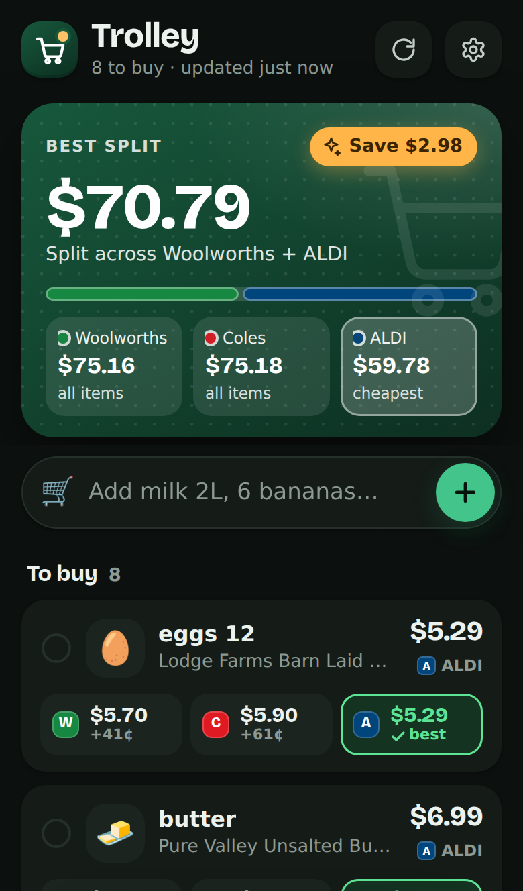

# Trolley

**Trolley** is a phone-friendly grocery list (PWA) that checks **Woolworths, Coles and ALDI**
for every item. It auto-picks the cheapest sensible match (comparing unit prices), then shows
each store's basket total plus a **best split** across stores with the savings. Your list lives
on your phone. A Cloudflare Worker hosts the app and fetches the store data, because the
supermarkets block requests made directly from a browser.

<p>
  
  
  
  
</p>

*Screenshots use real prices captured from the three stores on 28 Sep 2026.*

## Store status

Tested live on 28 Sep 2026, both from a server (`npm run check-stores`) and by running this
Worker's code on Cloudflare's own network (Workers preview, US data centres IAD and EWR).

| Store | Works from Cloudflare? | Notes |
|---|---|---|
| **Woolworths** | ✅ Yes, every test search worked | Behind Akamai bot protection, so the Worker visits the homepage first to get cookies. Uses Woolworths' standard online prices (not a specific store). |
| **Coles** | ✅ Yes, every test search worked | Prices for a chosen Coles store. Default: **Coles West End, QLD**. Change it in Settings with *Use my location*. |
| **ALDI** | ✅ Yes, about 1 in 40 requests is refused at random | ALDI's bot protection occasionally says no. The Worker tries up to 4 times and the app retries once more. ALDI prices are national. |

Your Worker will run in Cloudflare's Australian data centres. To re-test from there at any
time, open **Settings → Check stores now** in the app.

These are the stores' own website APIs, which aren't official public APIs. A store can change
or block them without notice. If that happens, *Check stores now* shows which one is failing,
and the app keeps working with the others.

## Deploy from your phone (about 10 minutes)

You need this GitHub repo and a free Cloudflare account. Everything below works in a phone
browser.

1. **Merge the pull request.** In the GitHub app (or github.com), open this repo → *Pull
   requests* → the Trolley PR → **Merge**.
   *(Optional: repo **Settings → General → Default branch** → set it to `main`.)*
2. **Create the Worker from GitHub.**
   1. Go to **dash.cloudflare.com** and log in or sign up (free plan is fine).
   2. Open the menu → **Workers & Pages** → **Create application** → next to
      **Import a repository**, tap **Get started**.
   3. Connect your GitHub account when asked. Allow access to the **Grocery-app** repo.
   4. Pick **Aianswers-dev/Grocery-app**.
   5. Settings:
      - **Project name:** `grocery-app`. It must match `name` in `wrangler.jsonc`, or the
        build fails.
      - **Build command:** leave empty.
      - **Deploy command:** `npx wrangler deploy` (the default).
      - **Production branch:** `main`.
   6. Tap **Save and Deploy** and wait a minute or two for the build to finish.
   7. If Cloudflare asks you to pick a `workers.dev` subdomain, choose any name.
3. **Set your passcode.** Open the **grocery-app** Worker → **Settings** → **Variables and
   Secrets** → **Add** → Type **Secret**, Name `APP_PASSCODE`, Value: a passphrase you'll
   remember → **Deploy**. Until this exists, the app refuses to fetch prices, so nobody else
   can use your Worker.
4. **Open the app.** On the Worker's page, open its URL. It looks like
   `https://grocery-app.<your-subdomain>.workers.dev`. Enter your passcode when asked.
5. **Add it to your home screen.**
   - iPhone (Safari): **Share** → **Add to Home Screen**.
   - Android (Chrome): **⋮** → **Add to Home screen** / **Install app**.
6. **Check the stores:** ⚙️ **Settings → Check stores now**. Under Coles, tap
   **Use my location** to use your nearest store.

**Updating:** every merge or push to `main` redeploys automatically.
**Cost:** Cloudflare's free Workers plan allows 100,000 requests a day, far more than a
grocery list needs.

**If something goes wrong**

| You see | Fix |
|---|---|
| "The server has no passcode yet" | Do step 3, then enter the same passcode in the app. |
| "That passcode didn't match" | Re-type it in ⚙️ Settings → Passcode. |
| The build fails, mentioning the name | The Cloudflare project name must be `grocery-app`. |
| A store shows **!** on items | Tap the item to see the error, or run ⚙️ → Check stores now. |

## Using the app

- **Add items** the way you'd write them. Separate several with commas.
  - `milk 2L`, `2 x milk 2L`, `milk x2`: quantity and size
  - `6 bananas`, `bananas 1kg`: loose produce by count or weight
  - `eggs 12`, `eggs dozen`, `coke 30 pack`: pack counts
- **How the auto-pick works**
  1. It keeps only *sensible* matches: every word you typed, and the item word must be what
     the product *is*. "Milk Chocolate" isn't milk. It also skips flavours and variants you
     didn't ask for, like chocolate, oat, peanut or microwave, and combos like "Macaroni &
     Cheese".
  2. It **stays near your size (±25%)**. If you typed no size, it uses the size most stores
     sell, so the totals are comparable. The item card shows that size (e.g. `≈2L`).
  3. It also allows exact multiples, e.g. 2 × 2L for `milk 4L`, or 6 loose bananas for
     `bananas 1kg`.
  4. Among those, the **lowest unit price** ($/L, $/kg or $/each) wins.
- **Price chips** on each item show every store's price and how much more it is than the best
  (e.g. `+41¢`):
  - Green with ✓ **best**: the cheapest store for that item. When prices are equal, your
    preferred store wins (Coles by default; change it in ⚙️ Settings → *When prices are equal,
    pick*), and the others say **same**.
  - **≈ smaller / bigger**: that store has nothing near your size. For picking the best store
    it's compared pro rata, so an 18-pack can't beat a 30-pack just by being smaller.
  - Orange ring on the store badge: a product you picked yourself.
  - **!**: the store couldn't be reached. **—**: no match at that store.
- **Gestures:** swipe an item **right** to tick it into the trolley, or **left** to remove it
  (with Undo). Drag any sheet down to close it.
- **Suggestions:** things you've added before show up as one-tap chips when you start typing.
- **Tap an item** to see every store's options, with unit prices and a value bar.
  - Tap a product to make it your pick. It's remembered for that item on this phone.
  - **Auto: cheapest** goes back to automatic.
  - **Skip <store>** leaves that store out for the item.
  - **↗** opens the product on the store's website.
- **Tap the green card** (or the floating total once you scroll) to open the basket: each
  store's total, the best split and what it saves, the best two-store combination, and a
  shopping plan grouped by store with tick boxes. **Share this plan** sends it as text.
- **Appearance:** ⚙️ Settings → System, Light or Dark.
- **Stored on the phone:** the list, your picks, suggestions and settings are in
  localStorage, and cached prices are in IndexedDB. Use ⚙️ **Back up list / Restore backup** to move them to another
  phone.
- **Price refresh:** prices refresh when they're more than 12 hours old, when you reopen the
  app, or when you tap ↻. The app itself works offline (e.g. in a store with bad
  reception), showing the last prices it fetched.

## Adding another supermarket

Each store is a plug-in in `src/stores/`. To add one (say IGA):

1. Create `src/stores/iga.js`:

   ```js
   import { parseUnitString } from '../../public/js/core/units.js';
   import { JSON_HEADERS, fetchWithTimeout, readJson } from '../http.js';

   export default {
     id: 'iga',            // short, URL-safe
     name: 'IGA',
     color: '#d71920',     // used for the store's dot and tabs
     // defaultLocation: { id: '123', label: 'IGA Somewhere' },  // if prices depend on a store
     async search(query, { location } = {}) {
       const res = await fetchWithTimeout(`https://example.iga/search?q=${encodeURIComponent(query)}`, { headers: JSON_HEADERS });
       const data = await readJson(res, 'IGA');
       return data.items.map((p) => ({
         id: String(p.id),                 // required
         name: p.name,                     // required, include the brand
         price: p.price,                   // required, what one item costs
         brand: p.brand, size: p.size,     // "2L", "500g", "12 pack"… helps size matching
         ...parseUnitString(p.unitPriceText), // -> { unitPrice, unitMeasure: 'L' | 'kg' | 'each' }
         wasPrice: null, promo: null, available: true,
         category: p.category, url: p.url, image: p.image,
       }));
     },
     // async findLocations(lat, lng) { return [{ id, label, detail }]; }  // optional store finder
   };
   ```
2. Add it to `STORES` in `src/stores/index.js`.
3. Try it live: `npm run check-stores -- --store iga`, and add a fixture test in
   `test/stores.test.js`.

The app needs no other changes. The new store gets its own price chip, tab, totals, place
in the best split, and on/off switch in Settings.

## Project layout

```
src/worker.js            Worker: API routes, passcode check, caching; serves /public
src/http.js              fetch helpers (timeouts, cookies, browser-like headers)
src/stores/              one plug-in per supermarket + index.js registry
public/                  the PWA (static, no build step)
  index.html, styles.css, manifest.webmanifest, sw.js, icons/, fonts/
  js/app.js              UI
  js/ui/                 icons, item emoji, swipe/drag gestures
  js/api.js, js/state.js talking to the Worker; storage on the phone
  js/core/               shared logic (also used by the Worker)
    query.js             "2 x milk 2L" -> { qty, name, size }
    units.js             pack sizes and unit prices
    match.js             relevance + size window + cheapest unit price
    basket.js            store totals, best split, savings, best two stores
scripts/check-stores.mjs live test against the real store websites
test/                    unit tests; fixtures are real store responses
```

## Development (on a computer)

```sh
npm install
npm test                          # unit tests (uses saved real store data, no network)
npm run check-stores              # live test of every store plug-in
echo "APP_PASSCODE=dev" > .dev.vars
npm run dev                       # app + API on http://localhost:8787
npm run check-stores -- --worker https://grocery-app.<you>.workers.dev --passcode <passcode>
```

The Worker API (all but `/api/stores` need the `X-Passcode` header):

| Endpoint | What it does |
|---|---|
| `GET /api/stores` | List the store plug-ins |
| `GET /api/search?store=coles&q=milk&loc=4553` | Search one store (`loc` = store/branch id, optional) |
| `GET /api/locations?store=coles&lat=…&lng=…` | Nearby branches, for stores with a store finder |
| `GET /api/status?q=milk` | Live check of every store |
| `GET /api/auth` | Check the passcode |

## Notes

- Prices are the stores' current online shelf prices, including specials. Member-only prices
  (Flybuys, Everyday Rewards) and multi-buy deals aren't included.
- ALDI doesn't sell groceries online, so its prices are the in-store prices listed on
  aldi.com.au.
- The display font is Bricolage Grotesque (SIL Open Font License, `public/fonts/OFL.txt`).
- This is for personal use. Be gentle: the app caches results and refreshes at most every
  12 hours.
